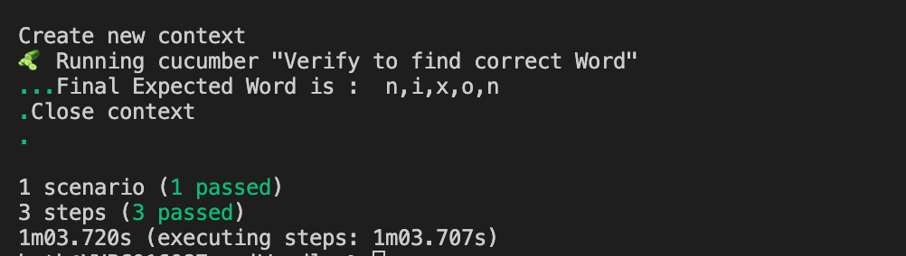
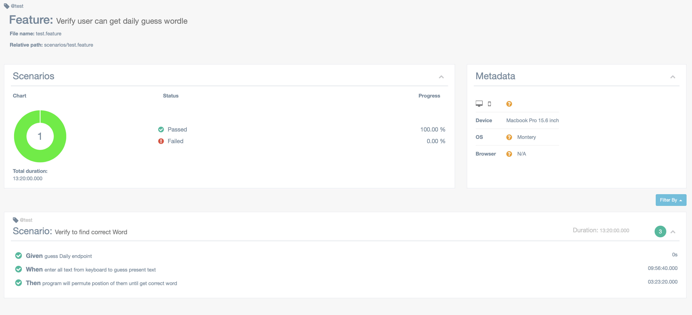

General information:

Based requirement ``The idea is to connect to an API that plays a Wordle-like puzzle.``
So i will summary quickly for my idea :
 ``Scenario: Verify to find correct Word``
       ``Given all Chacracters from keyboard``
        ``When enter all text from keyboard to guess present text``
        ``Then program will permute postion of them until get correct word``

How to run:
1. Clone sourcecode to local machine : git clone <ssh/http url>
2. Open by VSCode
3. Open Terminal, type: ``npm install`` 
4. Run test: ``npm run tags``
5. Export report: ``npm run report``

Screenshot:

